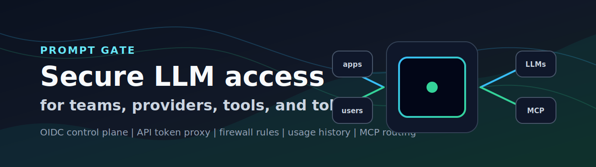
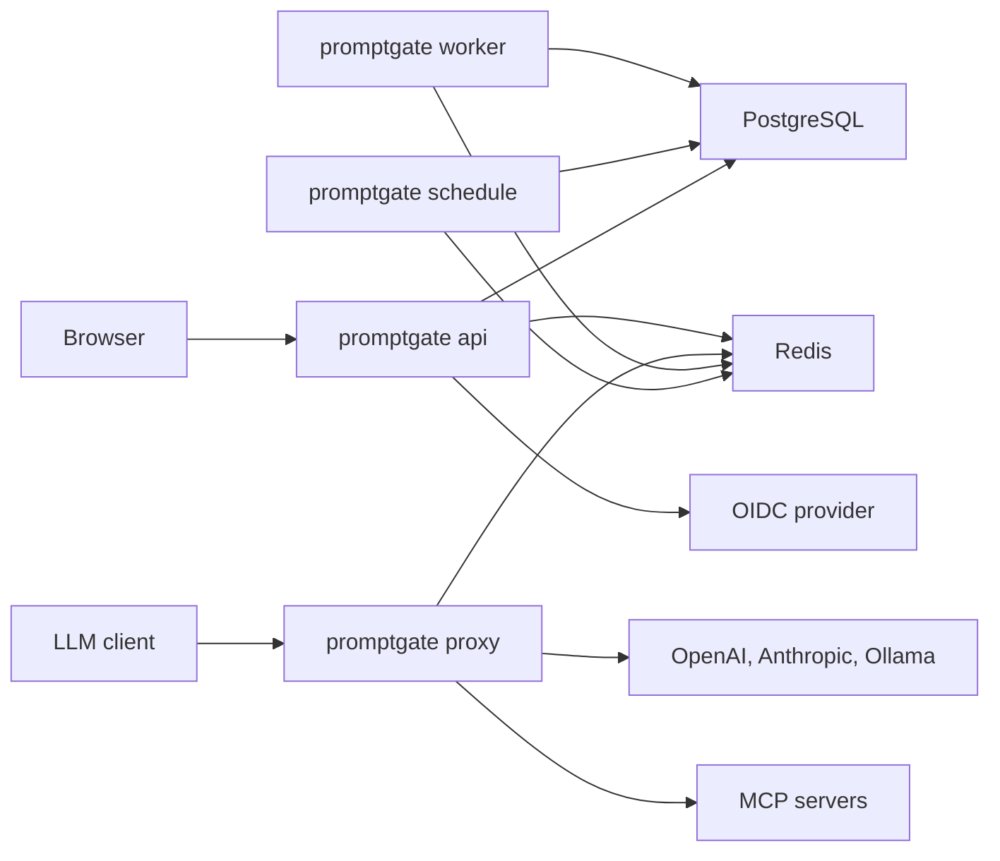
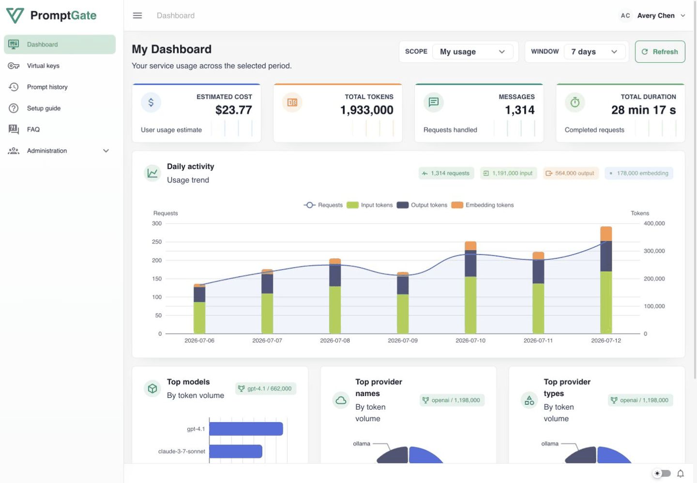
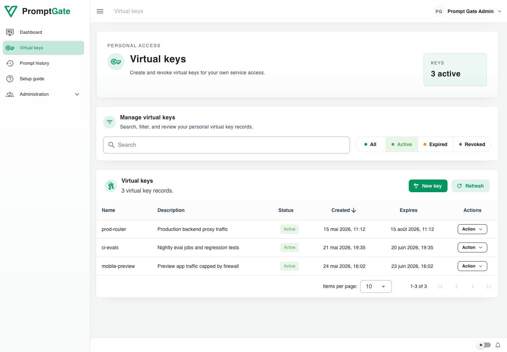
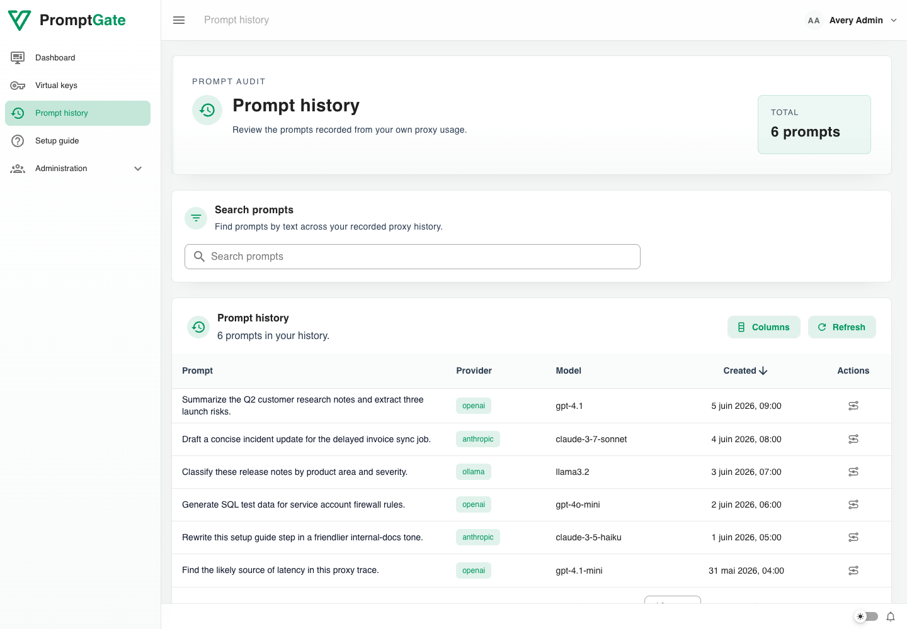
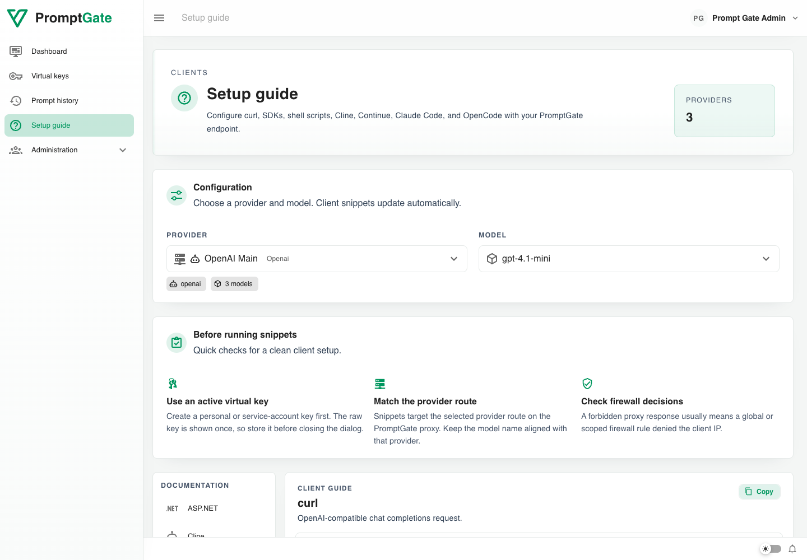
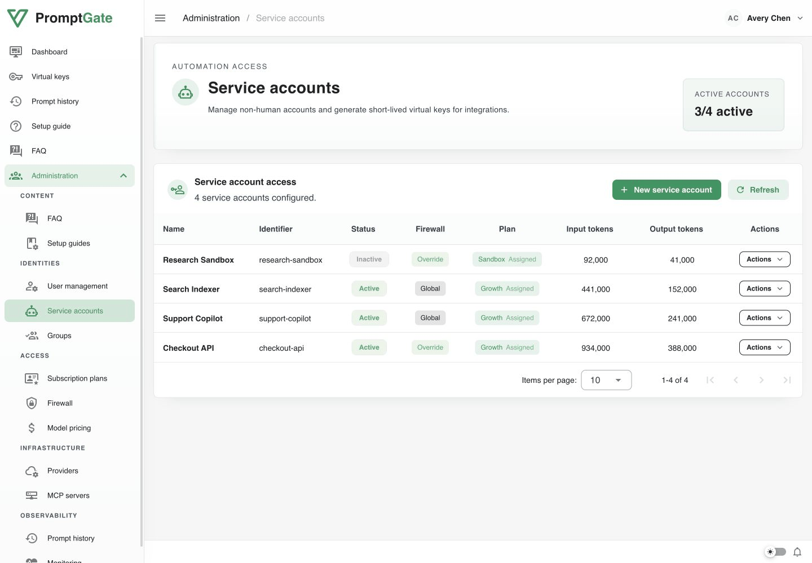
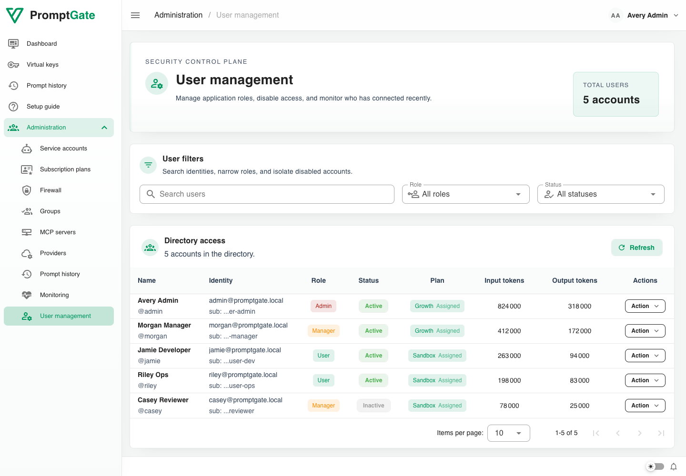
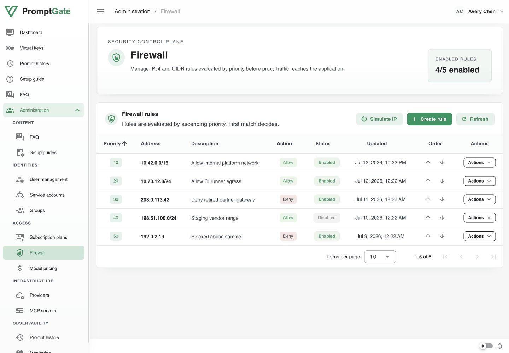

# Prompt Gate



Prompt Gate is the Go service layer for Prompt Gate, a control plane
for safely exposing LLM providers to teams. It combines browser login, role
management, API token issuance, a provider-aware LLM proxy, MCP server routing,
firewall checks, usage recording, and scheduled cleanup jobs.

The product is designed as a small set of deployable processes built from one
binary:

- `api` runs the HTTP API, OIDC login flow, admin endpoints, and
  optional static frontend hosting.
- `proxy` runs the LLM proxy that validates Prompt Gate API tokens,
  applies firewall rules, routes to configured providers, and enqueues usage.
- `worker` consumes proxy usage events, stores raw prompt exploration data, and
  updates dashboard KPI aggregates.
- `schedule` runs recurring background jobs, including raw usage cleanup.
- `migrate` applies database schema migrations.

## Quick Start

The fastest local path is Docker Compose. It starts PostgreSQL, Redis,
Keycloak, migrations, the API, the proxy, the worker, the scheduler, and a seeded
local Ollama provider.

```sh
docker compose up --build
```

Open the application at `http://localhost:8080`.

Useful local credentials:

- Keycloak admin console: `http://keycloak.localhost:8082`
- Keycloak admin user: `admin` / `admin`
- Prompt Gate test user: `admin` / `admin`

For source-based development:

```sh
cp .env.example .env
make deps
make test
make migrate
make run-api
make run-proxy
make run-worker
make run-schedule
```

Or run all backend processes from one terminal:

```sh
make run-all
```

## Requirements

- Go 1.25.6
- Node.js 24 for frontend asset builds
- PostgreSQL
- Redis
- Keycloak or another OIDC-compatible identity provider
- Docker for container builds and local Compose

## Main Commands

```sh
make deps       # download Go modules
make fmt        # format Go files
make fmt-check  # verify Go formatting
make vet        # run go vet
make test       # run backend tests
make build      # build bin/promptgate
make clean      # remove local binaries
```

The Docker image builds one binary at `/app/promptgate` and exposes:

- port `8080` for the API
- port `8081` for the proxy

The default container command starts the API:

```text
/app/promptgate api
```

## Project Shape

Prompt Gate stores durable state in PostgreSQL and uses Redis for browser
sessions, proxy auth caching, configuration snapshots, and hot-reload events.
Proxy usage events also flow through Redis before workers persist them to
PostgreSQL.
OIDC handles browser identity, while Prompt Gate API tokens authenticate proxy
traffic from applications and service accounts.



## Screenshots

These populated states use representative local data so the core product
surfaces are easier to review at a glance.

### Dashboard



Usage totals, request volume, token trends, and top model/provider breakdowns.

### Virtual Keys



Personal virtual key inventory with status, creation dates, expiry dates, and
row actions.

### Prompt History



Recorded proxy prompts with provider, model, token usage, duration, and
timestamp context.

### Setup Guide



Client setup flow for selecting providers, matching routes, and copying
ready-to-use snippets.

### Service Accounts



Non-human account management with activation status, scoped firewall mode,
usage totals, and integration key actions.

### User Management



Admin directory view for reviewing roles, active state, usage totals, and
account-level actions.

### Firewall



Admin rule ordering for IPv4 and CIDR access decisions before proxy traffic is
accepted.

## Documentation

Start with the documentation index, then jump into the area you are working on:

- [Documentation index](docs/README.md)
- [Architecture](docs/architecture.md)
- [API reference](docs/api.md)
- [Proxy runtime](docs/proxy.md)
- [Scheduler](docs/scheduler.md)
- [Security model](docs/security.md)
- [Development guide](docs/development.md)
- [Deployment guide](docs/deployment.md)
- [Environment variables](docs/environment.md)
- [Release process](docs/release.md)

## Docker Image

Build the production image locally:

```sh
docker build -t prompt-gate-backend:test .
```

The image also builds the Nuxt frontend as static assets and serves them from
the API process when `PROMPTGATE_STATIC_ASSETS_DIR` is set.

Official release image:

```text
ghcr.io/thomas-illiet/prompt-gate
```

## CI And Releases

The `CI` workflow runs formatting, vet, tests, backend build, frontend lint,
frontend typecheck, frontend tests, Compose validation, and a Docker image
build.

The `Release` workflow runs when a semver tag matching `vX.Y.Z` is pushed. It
publishes the Docker image to GitHub Container Registry and creates a GitHub
Release.
