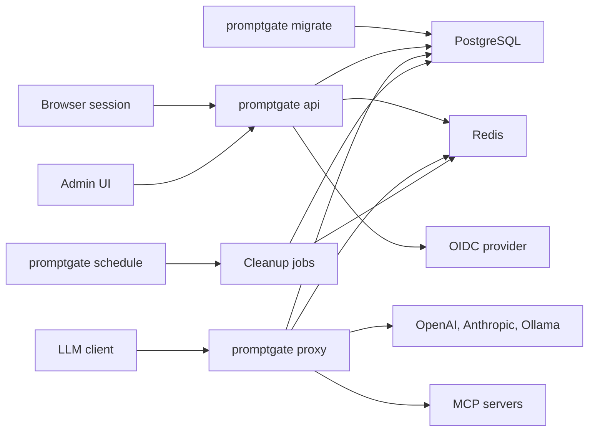
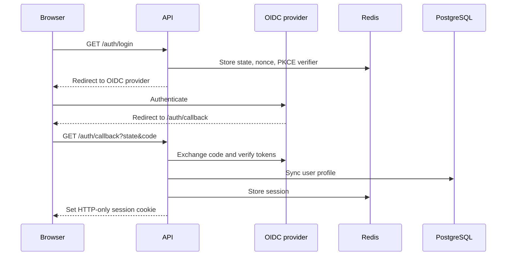
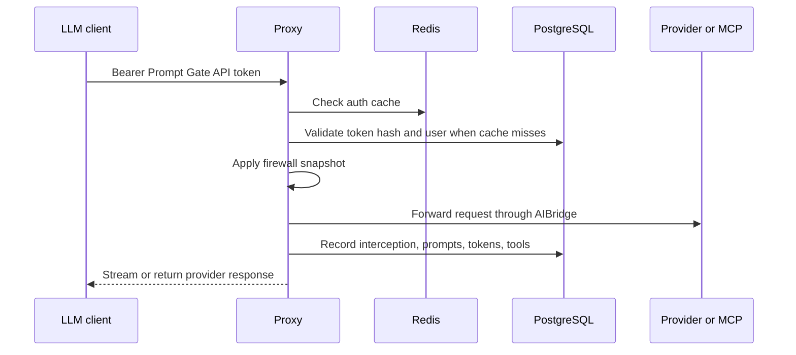
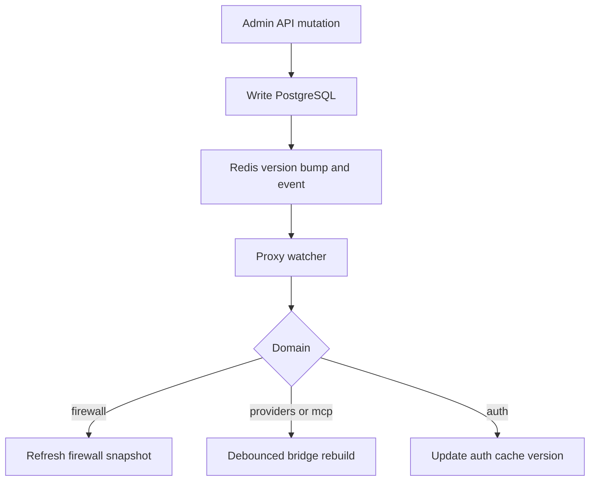

# Architecture

Prompt Gate Backend is a Go service layer split into four runtime commands from
one binary. Each command has a narrow operational responsibility and shares the
same domain packages.

## Runtime Components

| Command | Responsibility |
| --- | --- |
| `promptgate api` | HTTP API, OIDC browser login, sessions, user/admin routes, token creation, provider and MCP configuration, firewall management, optional static frontend hosting. |
| `promptgate proxy` | API-token authentication for LLM traffic, firewall enforcement, provider routing, MCP proxying, usage and prompt recording, hot reload. |
| `promptgate schedule` | Background token expiration marking and user access expiration. |
| `promptgate migrate` | GORM migrations for users, tokens, firewall rules, providers, MCP servers, and proxy recorder tables. |

## Package Layout

| Area | Main responsibility |
| --- | --- |
| `cmd/` | Cobra command tree and runtime bootstrapping. |
| `internal/runtime/app` | Shared application wiring for API and scheduler. |
| `internal/runtime/proxy` | AIBridge proxy manager, provider adapters, MCP proxy construction, hot reload. |
| `internal/domain/auth` | OIDC, sessions, roles, user profile context, proxy actor injection. |
| `internal/domain/tokens` | Prompt Gate API token creation, validation, revocation, cleanup, Redis auth cache. |
| `internal/domain/users` | Human users, service accounts, role management, access expiration. |
| `internal/domain/firewall` | Global and service-account firewall rules, snapshots, middleware. |
| `internal/domain/provider` | LLM provider configuration, encrypted API keys, setup helper metadata. |
| `internal/domain/mcp` | MCP server configuration, encrypted sensitive headers, regex filters. |
| `internal/domain/proxy` | Usage, prompt, tool, and interception recording plus dashboards. |
| `internal/platform/*` | Configuration, Postgres, Redis, migrations, and secret encryption. |
| `internal/transport/httpapi` | HTTP routes and JSON handlers. |
| `internal/transport/httpmiddleware` | Session, CORS, authorization, and request logging middleware. |

## Data Stores

PostgreSQL is the source of truth for durable application data:

- users and service accounts
- Prompt Gate API token records and token hashes
- firewall rules
- LLM provider definitions
- MCP server definitions
- proxy interceptions, token usage, prompts, and tool usage

Redis is required by the current runtime configuration. It is used for:

- browser sessions and OIDC authorization requests
- proxy auth cache entries
- provider, MCP, and firewall snapshots
- config version counters and hot-reload events

## Request Flows

### Browser API Flow

Protected API routes then use the session cookie, refresh the user profile from
the database, reject inactive or `none` users, and enforce route-level roles.

### Proxy Flow

The proxy removes `Authorization` and `X-Api-Key` before forwarding so Prompt
Gate credentials are not leaked to upstream providers.

## Configuration Reload

Configuration mutations publish Redis events on `promptgate:config:events`.
The proxy subscribes to those events and reacts without a process restart.

Provider and MCP updates trigger a debounced bridge rebuild. Firewall updates
refresh the in-memory snapshot only. Auth updates bump the token auth cache
version, which invalidates old cache keys.

## Migrations

`promptgate migrate` runs GORM migrations in dependency order:

1. users
2. tokens
3. firewall
4. providers
5. MCP
6. proxy recorder tables

Run migrations before starting API, proxy, or scheduler processes in a new
environment.
