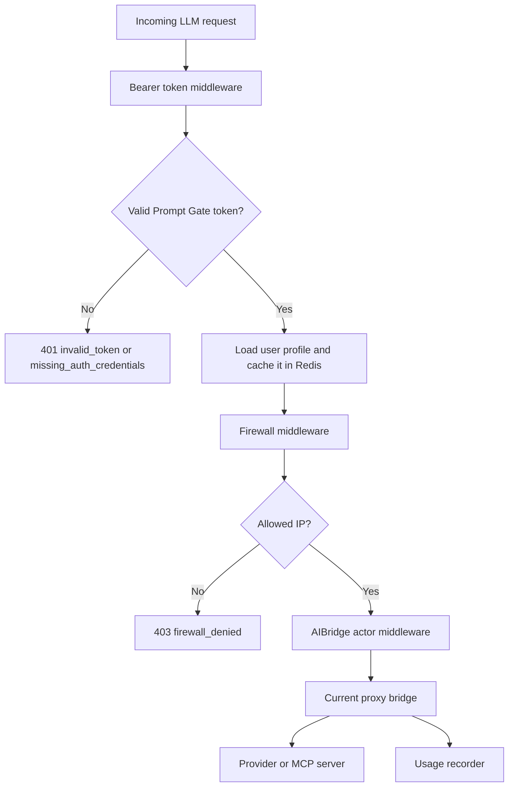

# Proxy Runtime

The proxy process is started with:

```sh
promptgate proxy
```

It listens on `PROMPTGATE_PROXY_PORT`, defaults to port `8081`, and serves the
LLM proxy on `/`. It also exposes:

```text
GET /health
```

## Request Pipeline



The proxy strips inbound `Authorization` and `X-Api-Key` headers after Prompt
Gate authentication so local credentials are not forwarded upstream.

## Provider Routing

Enabled providers are loaded from PostgreSQL or a Redis snapshot when the proxy
runtime starts. Supported provider types are:

- `openai`
- `anthropic`
- `ollama`

Provider API keys are stored encrypted with `PROMPTGATE_SECRETS_KEY` and are
decrypted only when building the runtime provider client.

The setup helper returns these base URL patterns:

| Provider type | Client-facing proxy prefix |
| --- | --- |
| `openai` | `<proxy-base-url>/<provider-name>/v1` |
| `ollama` | `<proxy-base-url>/<provider-name>/v1` |
| `anthropic` | `<proxy-base-url>/<provider-name>` |

Provider names must be lowercase DNS-like names such as `openai-main` or
`local-ollama`.

## MCP Routing

Enabled MCP servers are loaded into an AIBridge MCP proxy manager. Each server
has:

- a unique lowercase name
- a URL
- optional headers
- optional `allowPattern` and `denyPattern` regex filters
- an enabled flag

Sensitive header values are encrypted in PostgreSQL. When MCP initialization
returns a warning, the proxy logs it and continues with the available tools.

## Firewall Behavior

The proxy evaluates firewall rules after token authentication and before
forwarding to providers.

Global firewall rules apply to human users and service accounts that do not
enable firewall override:

- enabled rules are evaluated by ascending priority
- first matching rule wins
- no match allows the request

Service accounts with `firewallOverrideEnabled=true` use only their scoped
rules:

- enabled scoped rules are evaluated by ascending priority
- first matching rule wins
- no match denies the request

By default the proxy uses the TCP remote address. In production, prefer setting
`PROMPTGATE_PROXY_TRUSTED_PROXIES` to the CIDRs of trusted ingress or reverse
proxy hops. The proxy will then trust `X-Forwarded-For` and `X-Real-IP` only
when the direct peer is in those CIDRs.

`PROMPTGATE_PROXY_TRUST_FORWARD_HEADERS=true` remains available as a legacy
global trust switch. Enable it only behind infrastructure that strips or
rewrites untrusted forwarded headers.

## Usage Recording

The proxy recorder stores:

- interception start and end timestamps
- initiating user or service account
- provider name and provider type
- model name
- token usage, including cache read/write token counts
- prompt history
- MCP tool usage and tool invocation errors

This data powers the current-user dashboard, admin prompt history, and user or
service-account usage totals.

## Redis Cache And Snapshots

The proxy uses Redis for:

- API token auth cache keys
- provider snapshots
- MCP server snapshots
- firewall snapshots
- config version counters
- config reload pub/sub

`PROMPTGATE_REDIS_CACHE_TTL` controls the default TTL for snapshots and cached
auth records. Cached auth entries also never outlive the token's expiration.

## Hot Reload

The proxy subscribes to `promptgate:config:events`.

| Event domain | Proxy action |
| --- | --- |
| `firewall` | Refresh the firewall snapshot. |
| `providers` | Schedule a debounced bridge rebuild. |
| `mcp` | Schedule a debounced bridge rebuild. |
| `auth` | Update the auth cache version. |

`PROMPTGATE_PROXY_RELOAD_DEBOUNCE` controls provider and MCP rebuild debounce
time. The proxy also listens for `SIGHUP` and runs a full runtime reload when
the signal is received.

If a reload fails, the proxy logs the error and keeps the previous working
bridge.

## Startup Requirements

The proxy requires:

```sh
PROMPTGATE_DATABASE_URL
PROMPTGATE_REDIS_URL
PROMPTGATE_JWT_SECRET
PROMPTGATE_SECRETS_KEY
```

At least one supported enabled provider must exist before the proxy can build
its initial runtime bridge.
