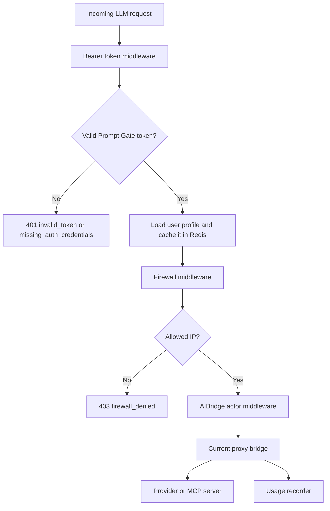

# Proxy Runtime

The proxy process is started with:

```sh
promptgate proxy
```

It listens on `PROMPTGATE_PROXY_PORT`, defaults to port `8081`, and serves the
LLM proxy on `/`. It also exposes:

```text
GET /health
```

## Request Pipeline


```mermaid
flowchart TD
    A["Incoming LLM request"] --> B["Bearer token middleware"]
    B --> C{"Valid Prompt Gate token?"}
    C -->|No| D["401 invalid_token or missing_auth_credentials"]
    C -->|Yes| E["Load user profile and cache it in Redis"]
    E --> F["Firewall middleware"]
    F --> G{"Allowed IP?"}
    G -->|No| H["403 firewall_denied"]
    G -->|Yes| I["AIBridge actor middleware"]
    I --> J["Current proxy bridge"]
    J --> K["Provider or MCP server"]
    J --> L["Usage recorder"]
```

The proxy strips inbound `Authorization` and `X-Api-Key` headers after Prompt
Gate authentication so local credentials are not forwarded upstream.

## Provider Routing

Enabled providers are loaded from PostgreSQL or a Redis snapshot when the proxy
runtime starts. Supported provider types are:

- `openai`
- `anthropic`
- `ollama`

Provider API keys are stored encrypted with `PROMPTGATE_SECRETS_KEY` and are
decrypted only when building the runtime provider client.

The setup helper returns these base URL patterns:

| Provider type | Client-facing proxy prefix |
| --- | --- |
| `openai` | `<proxy-base-url>/<provider-name>/v1` |
| `ollama` | `<proxy-base-url>/<provider-name>/v1` |
| `anthropic` | `<proxy-base-url>/<provider-name>` |

Provider names must be lowercase DNS-like names such as `openai-main` or
`local-ollama`.

## MCP Routing

Enabled MCP servers are loaded into an AIBridge MCP proxy manager. Each server
has:

- a unique lowercase name
- a URL
- optional headers
- optional `allowPattern` and `denyPattern` regex filters
- an enabled flag

Sensitive header values are encrypted in PostgreSQL. When MCP initialization
returns a warning, the proxy logs it and continues with the available tools.

## Firewall Behavior

The proxy evaluates firewall rules after token authentication and before
forwarding to providers.

Global firewall rules apply to users and service accounts that do not enable
firewall override:

- enabled rules are evaluated by ascending priority
- first matching rule wins
- no match allows the request

Users and service accounts with `firewallOverrideEnabled=true` use only their
scoped rules:

- enabled scoped rules are evaluated by ascending priority
- first matching rule wins
- no match denies the request

By default the proxy uses the TCP remote address. In production, prefer setting
`PROMPTGATE_PROXY_TRUSTED_PROXIES` to the CIDRs of trusted ingress or reverse
proxy hops. The proxy will then trust `X-Forwarded-For` and `X-Real-IP` only
when the direct peer is in those CIDRs.

`PROMPTGATE_PROXY_TRUST_FORWARD_HEADERS=true` remains available as a legacy
global trust switch. Enable it only behind infrastructure that strips or
rewrites untrusted forwarded headers.

## Usage Recording

The proxy recorder stores:

- interception start and end timestamps
- initiating user or service account
- provider name and provider type
- model name
- token usage, including cache read/write token counts
- MCP tool usage and tool invocation errors
- the normalized client IP and its most recent use per user or service account

This data powers the current-user dashboard and user or service-account usage
totals. Prompt contents are never stored in PostgreSQL.

Usage events are injected into the `promptgate:usage:events` Redis Stream. When
the worker processes an `interception_started` event, it upserts the
`account_ip_addresses` row identified by the account and IP. `last_seen` only
moves forward, including when Redis retries or delivers older events later.
Requests rejected by authentication, firewall, group, or quota checks do not
create interceptions and therefore do not update this table.

## Phoenix tracing

Set `PROMPTGATE_OTEL_ENABLED=true` and configure
`PROMPTGATE_OTEL_ENDPOINT` to export OpenInference spans to Phoenix over
OTLP/HTTP. Traces contain the provider, model, complete account identity,
virtual-key ID and name, session, token breakdowns, estimated cost, latency,
tool calls, and errors. Provider credentials, Prompt Gate JWTs, and token hashes
are never attached to spans.

Prompt content requires the independent
`PROMPTGATE_OTEL_CAPTURE_PROMPTS=true` consent switch. When enabled, prompts
are exported in full without truncation or redaction. Model response text is
not exported. Telemetry failures are fail-open and do not change proxy or quota
behavior.

### Native conversation correlation

Prompt Gate uses only conversation identifiers supplied by supported clients;
it never generates, prefixes, hashes, or otherwise rewrites them. Header names
are case-insensitive, values are trimmed at their boundaries, and invalid or
oversized values are ignored. The first valid header in this list wins:

| Priority | Header | Known client | Phoenix mapping |
| ---: | --- | --- | --- |
| 1 | `x-claude-code-session-id` | Claude Code | `session.id` |
| 2 | `x-openwebui-chat-id` | Open WebUI | `session.id` |
| 3 | `x-coder-chat-id` | Coder Agents | `session.id` |
| 4 | `x-kilocode-taskid` | Kilo Code | `session.id` |
| 5 | `x-client-session-id` | GitHub Copilot CLI | `session.id` |
| 6 | `x-interaction-id` | GitHub Copilot VS Code | `session.id` |
| 7 | `x-mux-workspace-id` | Mux | `session.id` |
| 8 | `x-session-id` | OpenCode | `session.id` |
| 9 | `session-id` | OpenCode OpenAI plugin | `session.id` |
| 10 | `session_id` | Codex/AIBridge | `session.id` |

The selected value is also exported as `gen_ai.conversation.id`, while
`promptgate.session.source` records the matching header name.
`x-parent-session-id` is exported separately as
`promptgate.parent_session.id`, and `x-openwebui-message-id` as
`promptgate.message.id`; neither can become the conversation identifier.

For example, OpenCode can send `x-session-id` and
`x-parent-session-id`. Open WebUI can send `x-openwebui-chat-id` and
`x-openwebui-message-id`. Claude Code and Codex are accepted through their
native headers, with AIBridge's request-body extraction retained as a fallback
for Claude Code. A Langflow flow must map its existing `session_id` into a
supported provider header; Prompt Gate will not create one for it.

Incoming W3C `traceparent`, `tracestate`, and `baggage` fields are extracted to
preserve distributed trace ancestry. They represent trace propagation rather
than conversation identity: Prompt Gate never converts a trace ID or baggage
entry into `session.id`, and does not copy baggage entries into Phoenix span
attributes. The similarly named `Session-ID` from RFC 7989 is specific to SIP
and is not a generic HTTP session standard.

## Redis Cache And Snapshots

The proxy uses Redis for:

- API token auth cache keys
- provider snapshots
- MCP server snapshots
- firewall snapshots
- config version counters
- config reload pub/sub
- asynchronous proxy usage and account IP events

`PROMPTGATE_REDIS_CACHE_TTL` controls the default TTL for snapshots and cached
auth records. Cached auth entries also never outlive the token's expiration.

## Hot Reload

The proxy subscribes to `promptgate:config:events`.

| Event domain | Proxy action |
| --- | --- |
| `firewall` | Refresh the firewall snapshot. |
| `providers` | Schedule a debounced bridge rebuild. |
| `mcp` | Schedule a debounced bridge rebuild. |
| `auth` | Update the auth cache version. |

`PROMPTGATE_PROXY_RELOAD_DEBOUNCE` controls provider and MCP rebuild debounce
time. The proxy also listens for `SIGHUP` and runs a full runtime reload when
the signal is received.

If a reload fails, the proxy logs the error and keeps the previous working
bridge.

## Startup Requirements

The proxy requires:

```sh
PROMPTGATE_DATABASE_URL
PROMPTGATE_REDIS_URL
PROMPTGATE_JWT_SECRET
PROMPTGATE_SECRETS_KEY
```

At least one supported enabled provider must exist before the proxy can build
its initial runtime bridge.
