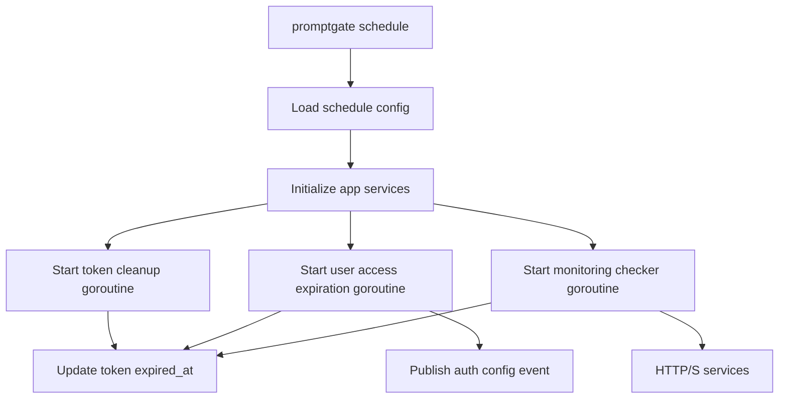

# Scheduler

The scheduler process runs recurring maintenance jobs:

```sh
promptgate schedule
```

It does not expose HTTP routes. It runs until the process receives `SIGINT` or
`SIGTERM`.

## Jobs

| Job | Default interval | Purpose |
| --- | --- | --- |
| Token cleanup | `1h` | Marks stored tokens as expired when `expires_at` is in the past and `expired_at` is still empty. |
| User access expiration | `1h` | Removes app access for users whose `expires_at` has passed and revokes their active tokens. |
| Monitoring checks | `15s` scheduler tick, per-service intervals | Runs due HTTP/S checks and marks enabled services `ok` or `degraded`. |

The access expiration job runs once immediately on startup and then repeats on
its interval. The token cleanup job starts its ticker and runs on the first
tick. Monitoring checks run once immediately on startup, then every `15s`; each
service is only checked when its own `intervalSeconds` has elapsed.

## Runtime Flow



When user access expires, affected users are assigned role `none`, their
`expires_at` value is cleared, and their non-revoked tokens are revoked in the
same transaction. An `auth` config event is then published so proxy auth caches
move to a new version.

Monitoring checks perform an HTTP `GET` with a `5s` timeout. A service is `ok`
when the response code equals its configured `expectedStatusCode`. Any network
error, timeout, or unexpected status code marks it `degraded` after the first
failed check. The next successful check clears the degraded state. Disabled
services are not selected by the scheduler and do not appear in the user-facing
monitoring banner.

## Required Configuration

The scheduler requires:

```sh
PROMPTGATE_DATABASE_URL
PROMPTGATE_REDIS_URL
PROMPTGATE_JWT_SECRET
PROMPTGATE_SECRETS_KEY
```

Optional scheduler settings:

| Variable | Default | Purpose |
| --- | --- | --- |
| `PROMPTGATE_LOG_LEVEL` | `info` | `debug`, `info`, `warn`, `warning`, or `error`. |
| `PROMPTGATE_TOKEN_CLEANUP_INTERVAL` | `1h` | Interval for expired token marking. |
| `PROMPTGATE_USER_ACCESS_EXPIRATION_INTERVAL` | `1h` | Interval for user access expiration. |
| `PROMPTGATE_REDIS_CACHE_TTL` | `5m` | Redis TTL used by shared services. |
| `PROMPTGATE_PROXY_RELOAD_DEBOUNCE` | `250ms` | Loaded for shared configuration consistency; scheduler jobs do not use it directly. |

Durations use Go duration syntax such as `30m`, `1h`, or `24h`.

## Deployment Notes

- Run exactly one scheduler replica unless the deployment platform provides a
  separate locking mechanism. The current scheduler code does not implement a
  distributed job lock.
- Start the scheduler after migrations have completed.
- Use the same `PROMPTGATE_JWT_SECRET` and `PROMPTGATE_SECRETS_KEY` values as
  API and proxy processes.
- Treat scheduler failures as operationally important because expired access
  and token state may lag until the process is restored.
