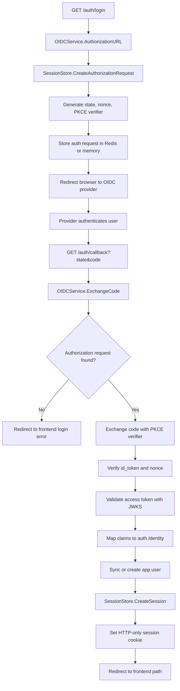
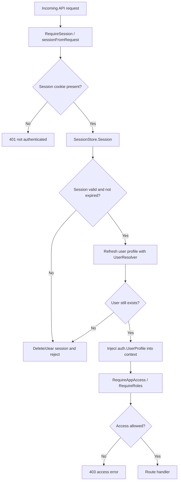
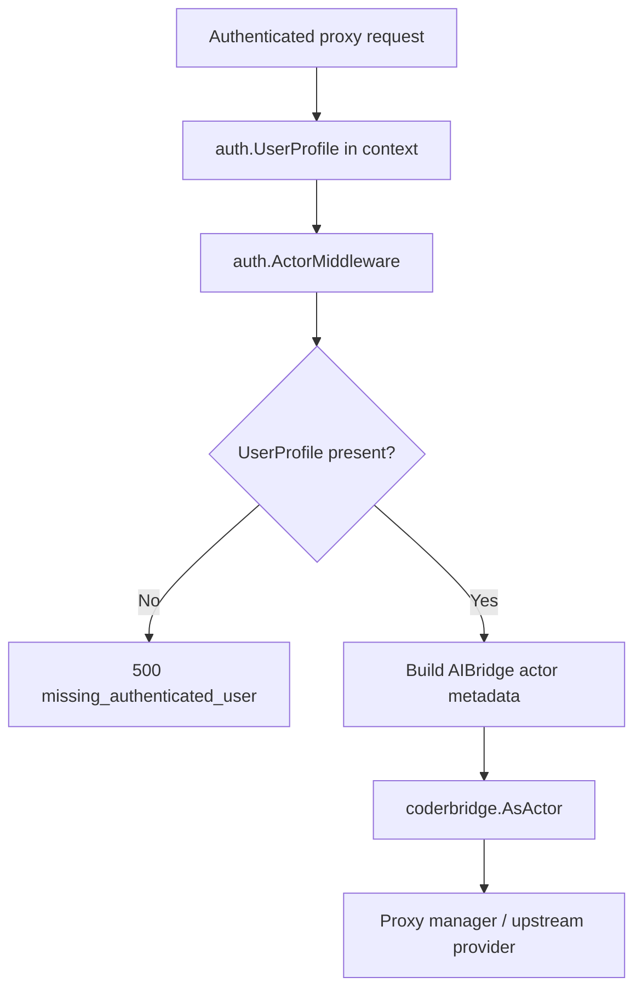

# Auth Package

This package owns OIDC login, browser sessions, user identity types, request
context helpers, access-token validation for OIDC, and actor injection for the
proxy bridge.

## OIDC Login Flow

## Protected Request Flow

## Proxy Actor Flow

## Runtime Behavior

- `OIDCService` creates PKCE-protected authorization requests and validates the
  callback with state, nonce, ID token verification, and access-token validation.
- `Validator` validates OIDC access tokens against the configured issuer and
  JWKS URL, then maps Keycloak claims into `auth.Identity`.
- `UserSynchronizer` turns an external identity into the local `UserProfile`.
- `SessionStore` stores browser sessions in Redis when configured, otherwise in
  process memory.
- Session lookup refreshes the user profile through `UserResolver`. If the user
  no longer exists, the session is deleted and rejected.
- `ContextWithUser` and `UserFromContext` are the shared contract used by API,
  token, firewall, and proxy middleware.
- `ActorMiddleware` requires an authenticated `UserProfile` in context and
  injects the AIBridge actor used by the proxy bridge.

## Package Layout

- `user.go`: roles, user types, `UserProfile`, OIDC identity claim mapping.
- `oidc.go`: OIDC authorization, callback exchange, redirect and logout URL
  helpers.
- `session_store.go`: auth request and session storage, Redis or memory backed.
- `validator.go`: access-token validation with JWKS.
- `context.go`: request context helpers for identity and user profile.
- `middleware.go`: AIBridge actor middleware.
- `user_sync.go`: interfaces implemented by the users domain.
