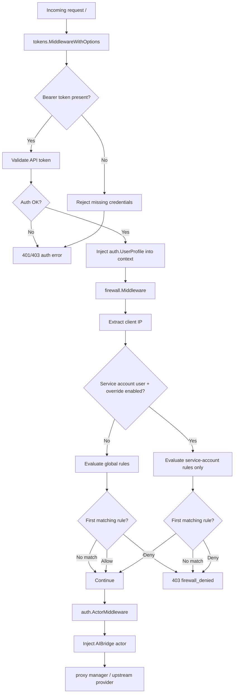

# Firewall Package

This package owns firewall rule storage, evaluation, snapshots, and the proxy
firewall middleware.

## Proxy Middleware Flow

## Runtime Behavior

- Proxy authentication runs before the firewall and injects `auth.UserProfile`
  into the request context.
- `firewall.Middleware` reads that profile when present and evaluates the client
  IP against the current in-memory snapshot.
- Service accounts with `firewallOverrideEnabled=true` use only their scoped
  firewall rules. Rules are evaluated by ascending priority, first match wins,
  and no match denies the request.
- Service accounts without override and human users use global firewall rules.
  Rules are evaluated by ascending priority, first match wins, and no match
  allows the request.
- Firewall denials return `403` with `{"error":"firewall_denied"}`.

## Data Model

- All firewall rules live in the `firewall_rules` table.
- Global rules use `type=global` and `referentiel_id=NULL`.
- Service-account rules use `type=service_account` and
  `referentiel_id=<service account user id>`.
- The API exposes scoped rules with `serviceAccountId`, mapped from
  `referentiel_id`.

## Package Layout

- `service.go`: service construction, notifier, migrations, shared errors.
- `global_rules.go`: global firewall rule CRUD and priority moves.
- `service_account_rules.go`: service-account scoped rule CRUD and priority
  moves.
- `evaluation.go`: allow/deny evaluation and IP matching.
- `snapshot.go`: snapshot loading and in-memory snapshot store.
- `middleware.go`: HTTP middleware, client IP extraction, denial response.
- `queries.go`: GORM query helpers, sorting, rule lookup, priority swaps.
- `validation.go`: address, priority, action, and uniqueness validation helpers.
